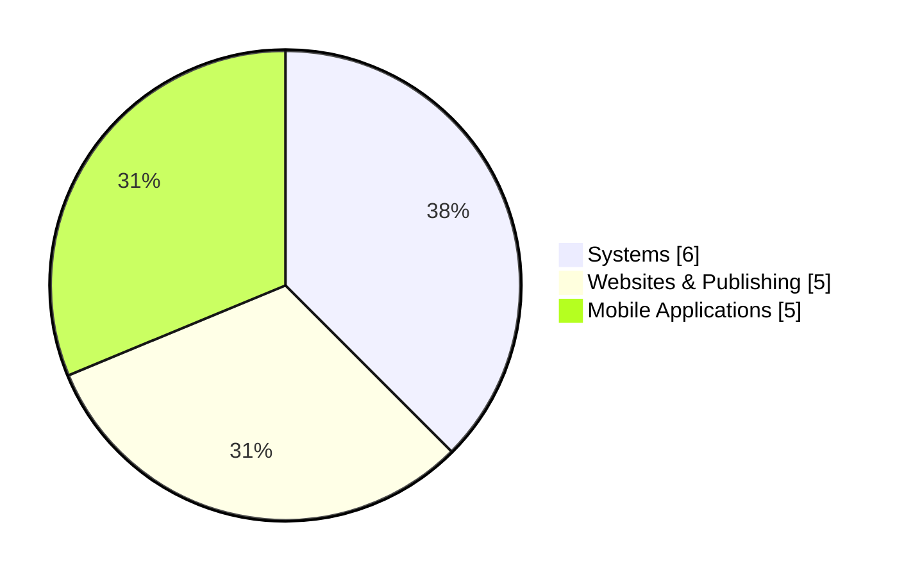

<!-- HERO -->

<h1 align="center">
  J A Y S O N&nbsp;&nbsp;R E Y E S
</h1>

<h3 align="center">
  Q U A S A R C O D E G E E K
</h3>

  <code>WEB DEVELOPER</code>
  &nbsp; // &nbsp;
  <code>SYSTEMS ANALYST</code>

  
  
  
  <!--  -->
  <!--  -->

  <!-- 
  
   -->
  <!-- 
   -->

<!-- 

  
  
  

 -->

  <code>◆ SYSTEM ONLINE ◆</code>

> **PLAYER NOTE:**
> I build with the goal of making technology useful, beneficial, and sustainable for our community, big or small.

---

# SKILL TREE

I specialize in development tools and workflows that make applications **maintainable, scalable, and consistent** — from frontend interfaces to backend systems and deployment workflows.

#### ◈ FRONTEND

#### ◈ BACKEND & DATABASE

#### ◈ DEVELOPMENT & DEPLOYMENT

#### ◈ DESIGN & WORKSPACE

#### ◈ AI & ASSISTED DEVELOPMENT

<!--  -->

#### ◈ SECURITY & SYSTEM PRACTICES

* Application Security
* Role-Based Access Control (RBAC)
* Authentication & Authorization
* Compliance & Data Management
* System Documentation

---

# REPOSITORY DISTRIBUTION

> **ARCHIVE NOTE:** Repository classifications describe the primary purpose of each project and are not a measure of project complexity.

---
